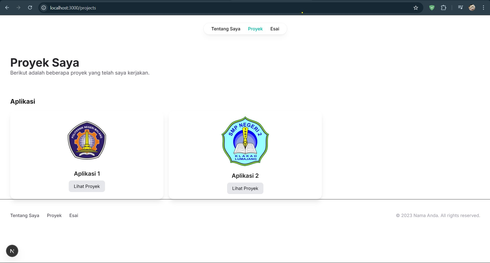
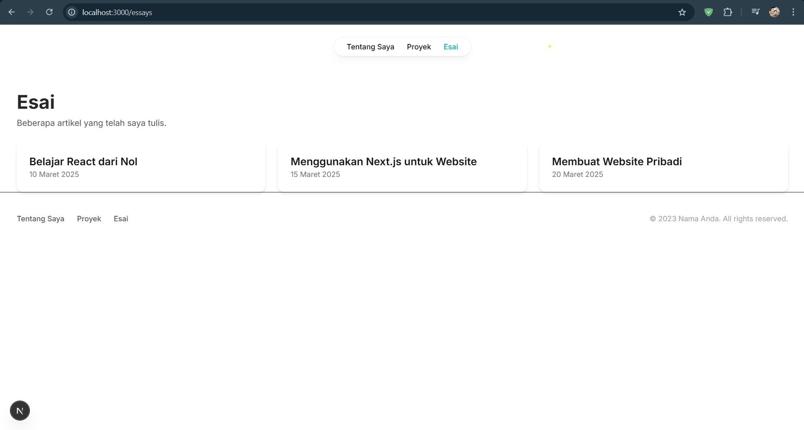
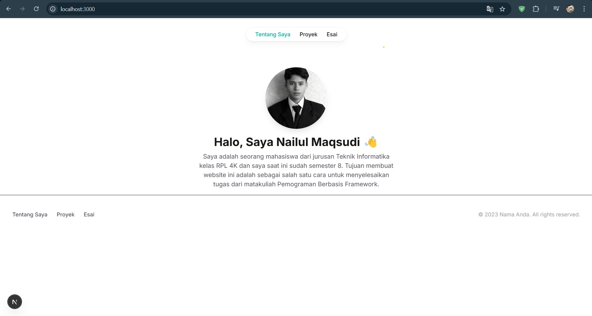

# 🚀 Pemograman Berbasis Framework - Modifikasi Halaman Esai & Tentang Saya

## 📌 Deskripsi
Website ini merupakan portfolio pribadi yang telah dimodifikasi pada beberapa bagian agar lebih menarik dan informatif.  
Perubahan yang dilakukan mencakup:

1. **Modifikasi Halaman "Proyek"**:
   - Menampilkan daftar aplikasi dalam bentuk **Grid Layout**.
   - Setiap apliasi memiliki **card-style** dengan shadow dan border radius.
   - Tampilan responsif untuk ukuran layar kecil hingga besar.

2. **Modifikasi Halaman "Esai"**:
   - Menampilkan daftar artikel dalam bentuk **Grid Layout**.
   - Setiap artikel memiliki **card-style** dengan shadow dan border radius.
   - Tampilan responsif untuk ukuran layar kecil hingga besar.

3. **Modifikasi Halaman "Tentang Saya"**:
   - Menambahkan **foto profil**.
   - Menambahkan **deskripsi singkat** tentang saya.
   - Menambahkan **ikon media sosial** (GitHub, LinkedIn, Twitter) untuk koneksi lebih luas.

---

## 🎨 **Tampilan Halaman**
### 🔹 **Halaman Esai** - Grid Proyek 📑  

### 🔹 **Halaman Esai** - Grid Artikel 📑  

### 🔹 **Halaman Tentang Saya** - Profil & Media Sosial 🧑‍💻  

